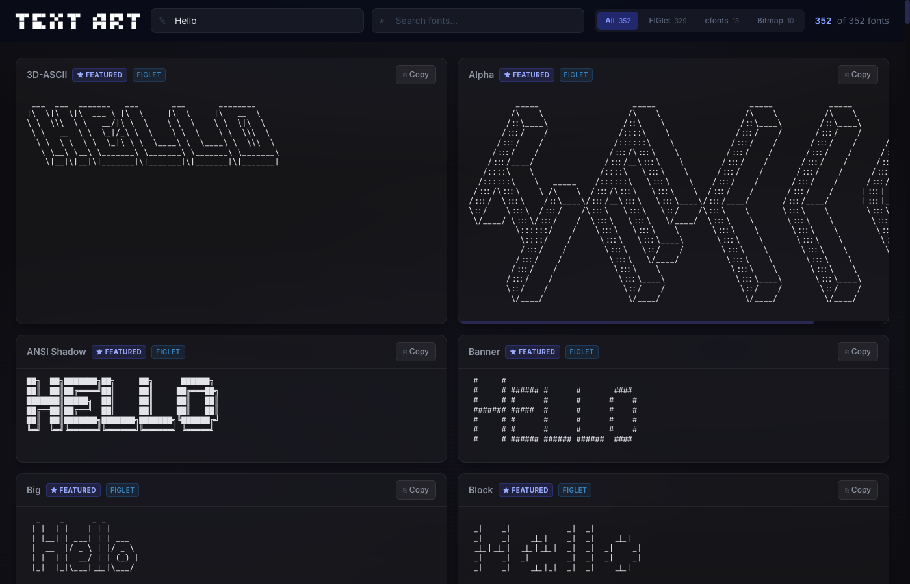
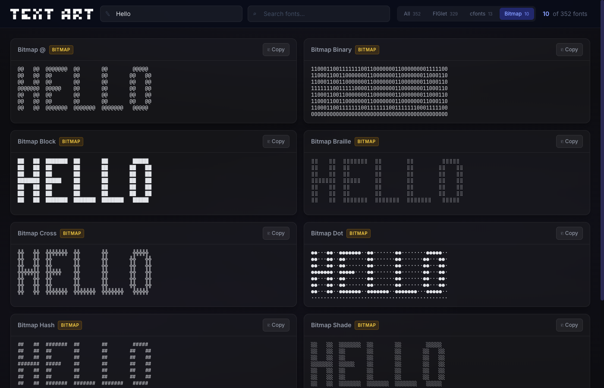

# ✦ Text Art Gallery

A modern, responsive web gallery to browse **352+ ASCII text art fonts** from 3 libraries — all in one place. Type any text and see it rendered in every style instantly.



## ✨ Features

- **352 fonts** from 3 libraries: FIGlet (329), cfonts (13), BitmapIt (10)
- **Real-time preview** — type and see all fonts update instantly
- **Library filter tabs** — switch between All / FIGlet / cfonts / Bitmap
- **Search** — find fonts by name
- **Copy to clipboard** — one-click copy of any text art
- **Responsive grid** — 1→2→3 columns across screen sizes
- **Lazy loading** — fonts load progressively for fast initial render
- **Dark glassmorphism UI** with smooth animations

### Bitmap Styles

10 unique rendering styles from the same bitmap font, each using different characters:



## 🛠️ Tech Stack

- **React 19** + TypeScript
- **Vite 7** (dev + build)
- **Tailwind CSS v4** (styling)
- **figlet** — 329 FIGlet fonts
- **cfonts** — 13 stylized console fonts (pre-bundled for browser)
- **bitmapit** — 10 bitmap pixel-art styles

## 🚀 Getting Started

```bash
# Install dependencies
npm install

# Generate font data (auto-scans packages)
npm run generate-fonts

# Start dev server
npm run dev

# Production build
npm run build
```

## 📁 Project Structure

```
src/
├── assets/              # Auto-generated font data
│   ├── fonts.ts         # 329 FIGlet font names
│   └── cfonts-data.ts   # 13 cfonts font JSON bundles
├── bitmap-renderer.ts   # BitmapIt renderer (10 styles)
├── cfonts-renderer.ts   # Browser-compatible cfonts renderer
├── FontCard.tsx          # Font card component
├── App.tsx              # Main app with grid layout + filters
└── index.css            # Tailwind CSS + custom styles

scripts/
└── generate-fonts.cjs   # Build-time font data generator
```

## 🔧 Regenerate Fonts

If `figlet` or `cfonts` packages are updated, regenerate the font data:

```bash
npm run generate-fonts
```

This scans `node_modules/figlet/importable-fonts/` and `node_modules/cfonts/fonts/` to produce type-safe TypeScript files.

## 📊 Font Libraries

| Library | Fonts | Style | Source |
|---------|-------|-------|--------|
| **FIGlet** | 329 | Classic ASCII art | [figlet](https://www.npmjs.com/package/figlet) |
| **cfonts** | 13 | Stylized block text | [cfonts](https://www.npmjs.com/package/cfonts) |
| **BitmapIt** | 10 | Pixel-art / retro | [bitmapit](https://www.npmjs.com/package/bitmapit) |

## 📜 License

MIT
